# microservices-ecommerce

Проект, выполненный в рамках курса по Go, представляет собой распределенную платформу электронной коммерции, построенную на базе микросервисной архитектуры и принципов Clean Architecture. Система разделена на ключевые сервисы: корзину (cart), систему управления заказами, товарами и складами (loms), а также сервис уведомлений (notifications). Взаимодействие между компонентами реализовано через синхронный gRPC с HTTP/REST-шлюзом (grpc-gateway) и надежную асинхронную доставку событий в Apache Kafka с использованием паттерна Transactional Outbox.
## Технологии

* **Go 1.26.2**
* **gRPC / Protocol Buffers**
* **gRPC-Gateway**
* **PostgreSQL**
* **sqlc**
* **Apache Kafka**
* **Transactional Outbox**
* **GoMock (`mockgen`)**
* **Docker / Docker Compose**
* **Taskfile (`task`)**
* **EasyP**

---

## Структура проекта

Проект организован как монорепозиторий на базе **Go Workspaces (`go.work`)**. Каждый микросервис изолирован и построен по принципам **Clean Architecture**.

```text
├── cart/                   # Сервис корзины 
├── loms/                   # Logistics & Order Management System (Заказы, Товары, Склады, Outbox)
├── notifications/          # Сервис нотификаций (Kafka Consumer)
├── integration-tests/      # Интеграционные тесты 
├── docs/                   # OpenAPI / Swagger 
├── Taskfile.yml            # Скрипты для автоматизации (генерация, линтинг, тесты, миграции)
└── go.work                 # Конфигурация Go Workspace
```

---

## Сервисы

### 1. Сервис корзины (`cart`)

Управление товарами в корзине пользователя, просмотр содержимого, очистка и запуск чекаута.

**API Эндпоинты:**
* `POST /v1/cart/item/add` — добавление товара в корзину
* `DELETE /v1/cart/item/delete` — удаление товара из корзины
* `GET /v1/cart/list` — просмотр содержимого корзины
* `POST /v1/cart/clear` — очистка корзины
* `POST /v1/cart/checkout` — оформление заказа из корзины

#### Добавление товара в корзину
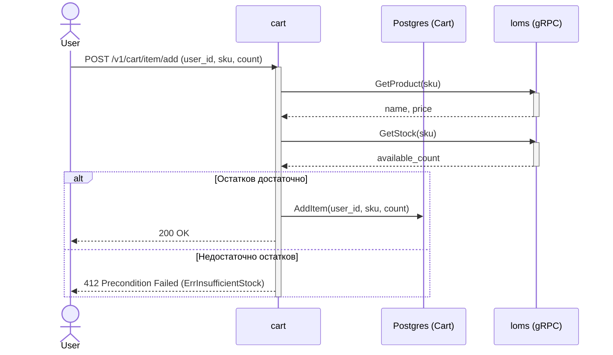

<details>
<summary><b>Просмотр корзины (List Cart)</b></summary>

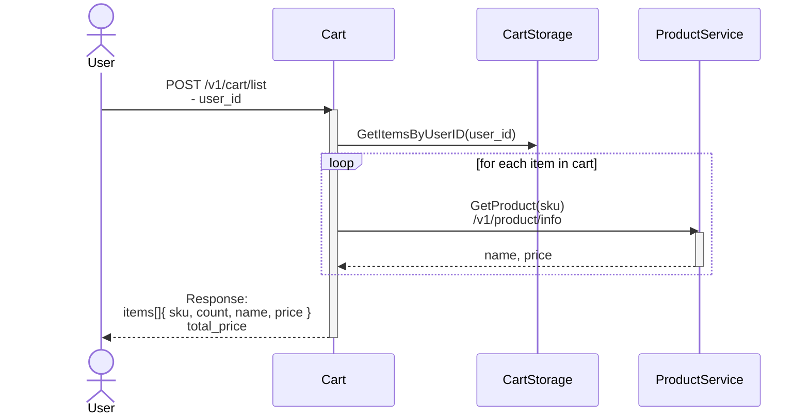

</details>

<details>
<summary><b>Создание заказа (Checkout)</b></summary>

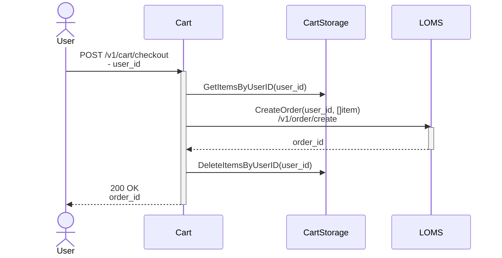

</details>

<details>
<summary><b>Удаление товара из корзины (Delete Item)</b></summary>

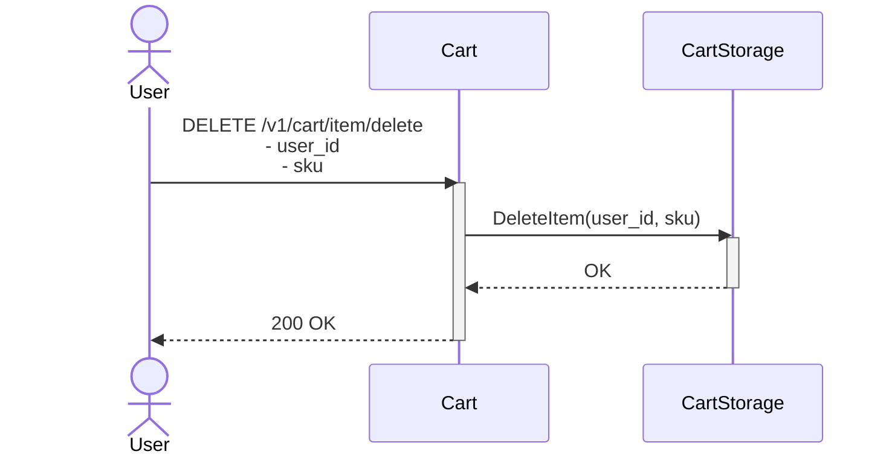

</details>

<details>
<summary><b>Очистка корзины (Clear Cart)</b></summary>

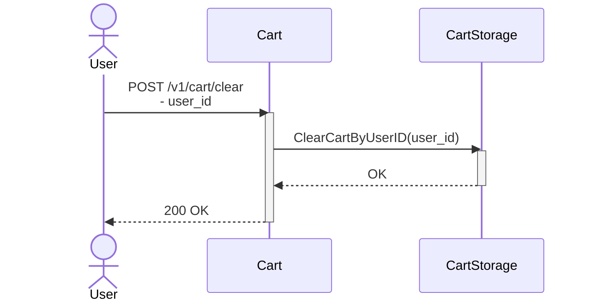

</details>

---

### 2. Сервис логистики и заказов (`loms`)

Logistics & Order Management System: управление заказами, каталогом товаров, складскими остатками и публикация событий через Transactional Outbox.

**API Эндпоинты:**

* **Orders (`Loms`):**
  * `POST /v1/order/create` — создание заказа и резервация остатков
  * `POST /v1/order/info` — получение информации о заказе
  * `POST /v1/order/pay` — оплата заказа
  * `POST /v1/order/cancel` — отмена заказа и снятие резервов
* **Products (`ProductService`):**
  * `POST /v1/product/create` — добавление товара в каталог
  * `POST /v1/product/info` — получение информации о товаре по SKU
  * `POST /v1/product/list` — батч-получение информации по списку SKU
* **Stocks (`Stocks`):**
  * `POST /v1/stock/set` — установка остатков по SKU
  * `POST /v1/stock/info` — получение доступного остатка по SKU

#### Создание заказа (Create Order & Outbox)
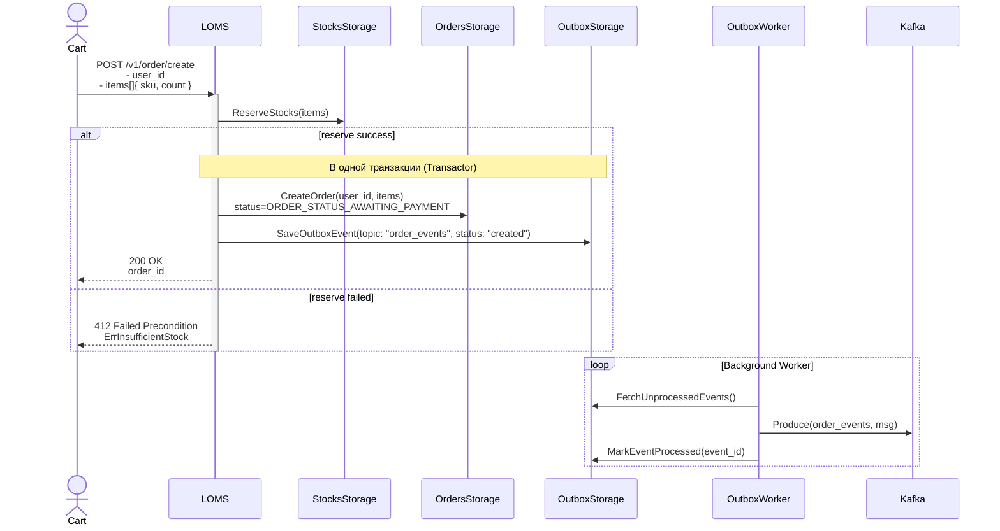

<details>
<summary><b>Получение информации о заказе (Get Order)</b></summary>

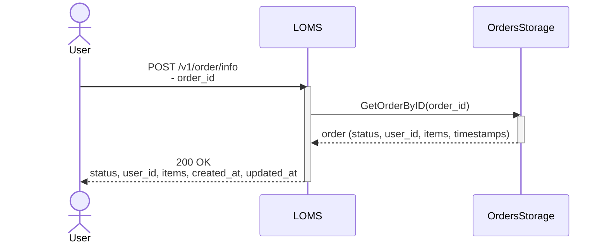

</details>

<details>
<summary><b>Оплата заказа (Pay Order)</b></summary>

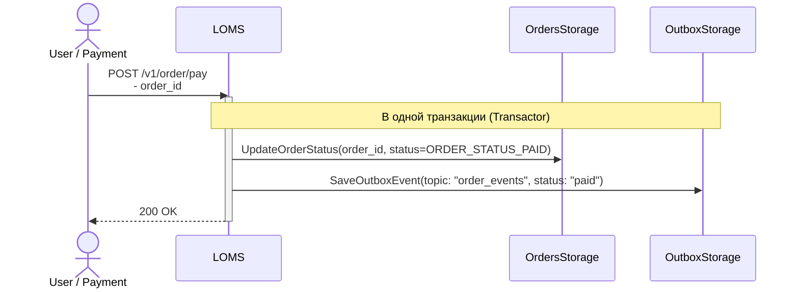

</details>

<details>
<summary><b>Отмена заказа (Cancel Order)</b></summary>

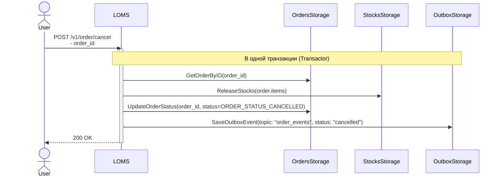

</details>

<details>
<summary><b>Создание товара (Create Product)</b></summary>

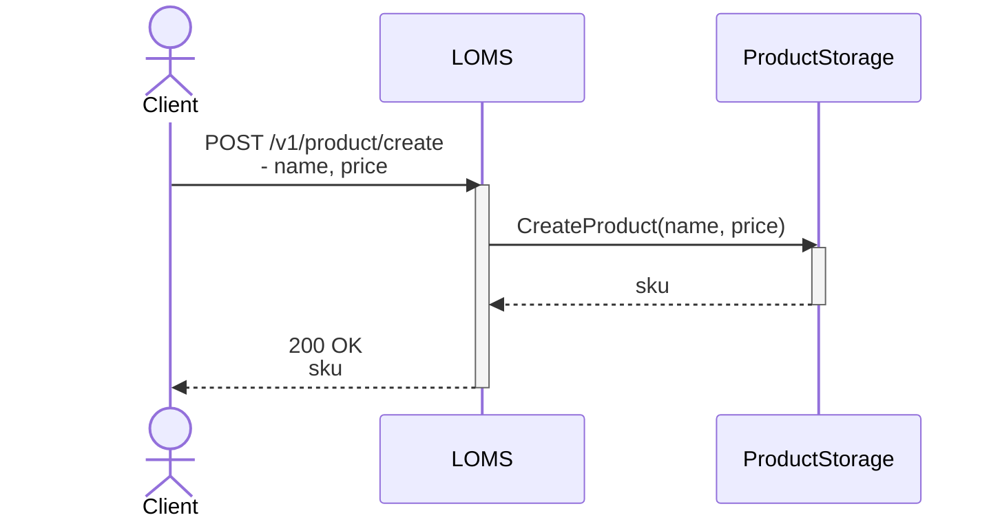

</details>

<details>
<summary><b>Получение информации о товаре (Get Product Info)</b></summary>

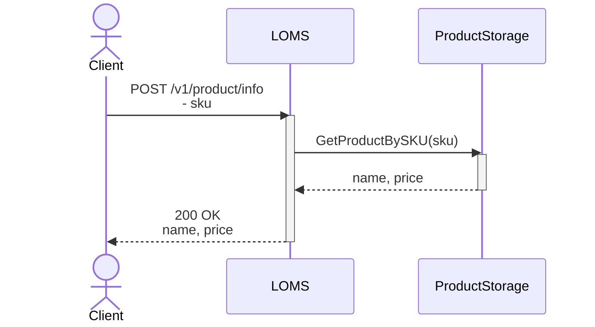

</details>

<details>
<summary><b>Список товаров (List Products)</b></summary>

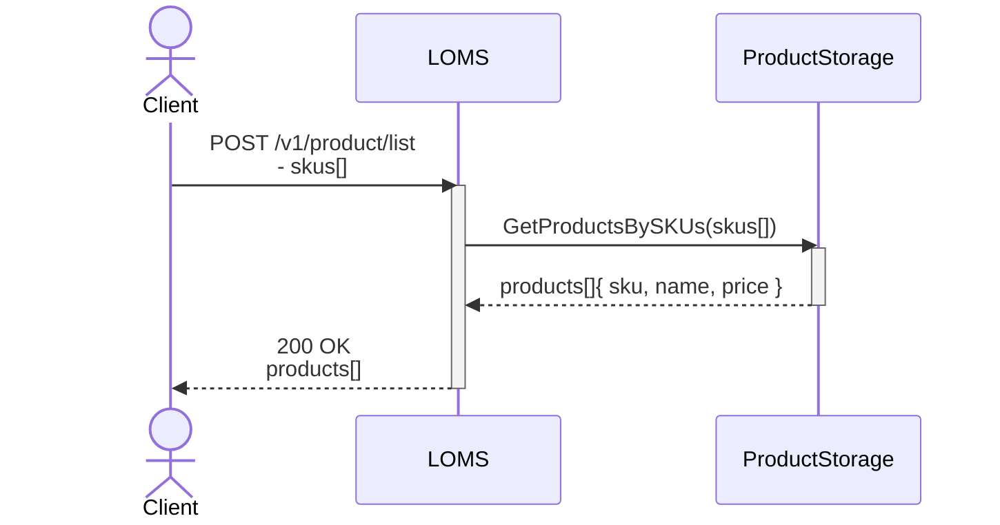

</details>

<details>
<summary><b>Установка остатка товара (Set Stock)</b></summary>

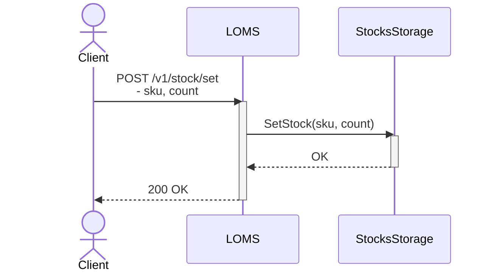

</details>

<details>
<summary><b>Получение остатка товара (Get Stock Info)</b></summary>

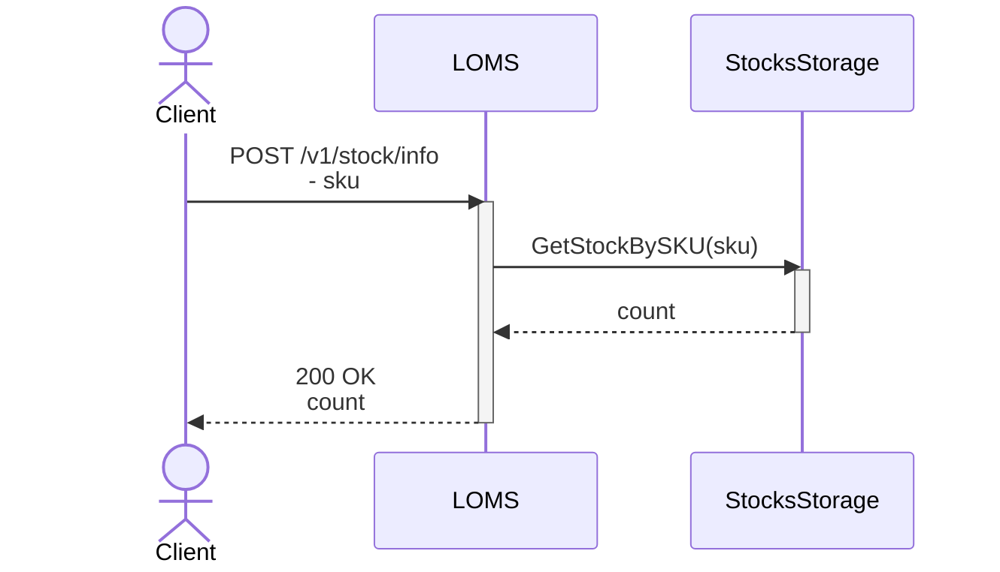

</details>

### 3. Сервис уведомлений (`notifications`)

Асинхронная обработка событий заказов из Apache Kafka с ручным управлением оффсетами (Manual Commit) и поддержкой очереди недоставленных сообщений (**Dead Letter Queue / DLQ**).

**Ключевые особенности консьюмера:**
* **Manual Commit:** фиксация смещения (`CommitMessage`) строго после успешной обработки в `notifier`.
* **DLQ (Dead Letter Queue):** битые сообщения (ошибки парсинга JSON) автоматически перенаправляются в топик `{topic}-dlq` с сохранением контекста ошибки, исходных партиций и оффсетов.
* **Retry Loop:** при сбое обработчика отправки сообщение не коммитится и повторно вычитывается.

#### Обработка событий заказа (Kafka Consumer Flow & DLQ)
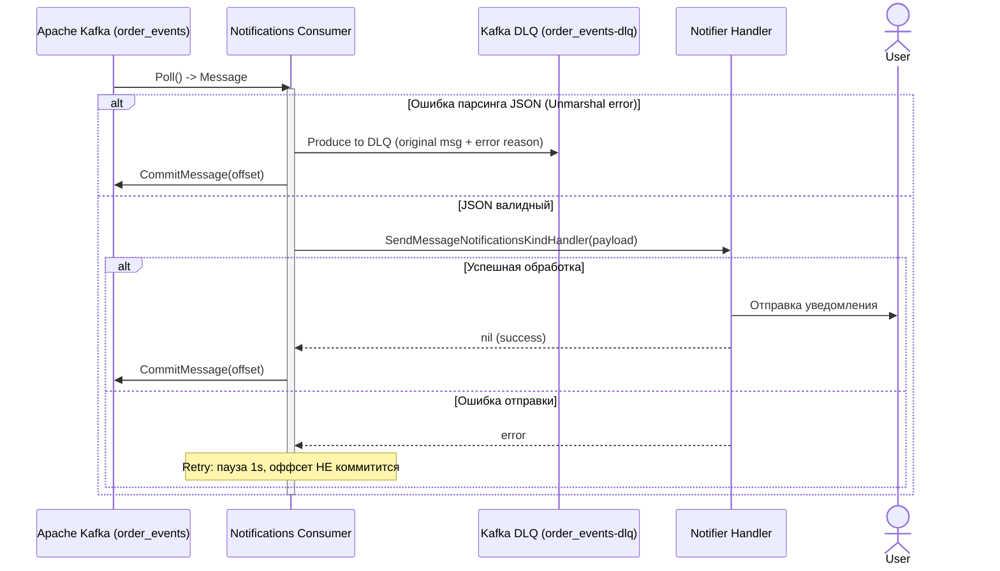

## Локальный запуск

```bash
go install [github.com/go-task/task/v3/cmd/task@latest](https://github.com/go-task/task/v3/cmd/task@latest)
```
```
task backend
```

```
docker compose ps
```

###  Порты и доступ к сервисам

| Сервис / Инстанс | Назначение | Протокол | Хост и Порт |
| :--- | :--- | :--- | :--- |
| **`cart` (Node 1)** | Сервис корзины | HTTP (REST / Gateway)<br/>gRPC | `http://localhost:8080`<br/>`localhost:50051` |
| **`cart-2` (Node 2)** | Сервис корзины (реплика) | HTTP (REST / Gateway)<br/>gRPC | `http://localhost:8090`<br/>`localhost:50061` |
| **`loms` (Node 1)** | Заказы, товары, склады | HTTP (REST / Gateway)<br/>gRPC | `http://localhost:8081`<br/>`localhost:50052` |
| **`loms-2` (Node 2)** | Заказы, товары, склады (реплика) | HTTP (REST / Gateway)<br/>gRPC | `http://localhost:8091`<br/>`localhost:50062` |
| **`notifications`** | Сервис нотификаций | gRPC | `localhost:50053` |
| **PostgreSQL** | База данных (`ecommerce`) | TCP | `localhost:5432` |
| **Apache Kafka** | Брокер сообщений | PLAINTEXT | `localhost:9092` / `localhost:9093` |
| **Kafdrop** | Web UI для Apache Kafka | HTTP | `http://localhost:9000` |

###  Переменные окружения (Environment Variables)

**Общие параметры подключения к базе данных (PostgreSQL)**
* `POSTGRES_HOST` — хост для подключения к СУБД (`postgres`)
* `POSTGRES_PORT` — порт сервера PostgreSQL (`5432`)
* `POSTGRES_DB` — имя рабочей базы данных (`ecommerce`)
* `POSTGRES_USER` — имя пользователя БД (`ecommerce_user`)

**Сервис корзины (`cart` / `cart-2`)**
* `GRPC_PORT` — сетевой порт gRPC-сервера (`50051` / `50061`)
* `GRPC_GATEWAY_PORT` — сетевой порт HTTP REST gRPC-Gateway (`8080` / `8090`)
* `LOMS_GRPC_ADDR` — адрес downstream-сервиса LOMS по gRPC (`loms:50052` / `loms-2:50062`)

**Сервис заказов и логистики (`loms` / `loms-2`)**
* `GRPC_PORT` — сетевой порт gRPC-сервера (`50052` / `50062`)
* `GRPC_GATEWAY_PORT` — сетевой порт HTTP REST gRPC-Gateway (`8081` / `8091`)
* `OUTBOX_WORKERS` — количество параллельных фоновых воркеров Outbox (`1`)
* `OUTBOX_BATCH_SIZE` — размер пачки сообщений, вычитываемых из БД за итерацию (`10`)
* `OUTBOX_FETCH_PERIOD` — интервал опроса таблицы Outbox (`200ms`)
* `OUTBOX_IN_PROGRESS_TTL` — время жизни зависшего сообщения перед повторной отправкой (`1s`)
* `KAFKA_BROKERS` — список брокеров Apache Kafka (`kafka-single:9092`)
* `KAFKA_NOTIFICATIONS_TOPIC` — целевой топик для публикации событий заказа (`order_status_notifications`)

**Сервис уведомлений (`notifications`)**
* `GRPC_PORT` — сетевой порт gRPC-сервера (`50053`)
* `CALLBACK_ADDR` — адрес внешнего сервиса для обратных HTTP-уведомлений (`integration-tests:8080`)
* `KAFKA_BROKERS` — список брокеров Apache Kafka (`kafka-single:9092`)
* `KAFKA_NOTIFICATIONS_TOPIC` — топик для вычитывания событий (`order_status_notifications`)
* `KAFKA_CONSUMER_GROUP` — идентификатор consumer-группы Kafka (`notifications`)

## Тестирование
* `task test` - запуск интеграционных тестов
* `task unit-test` - запуск юнит тестов(перед запуском нужно выполнить комаду 
task generate для генерации моков)


## Другие полезные команды

* `task up` — фоновый запуск сервисов
* `task down` — остановка и очистка
* `task lint` — проверка линтером
* `task generate` — генерация всего кода
* `task fast-generate` — быстрая кодогенерация
* `task bin-deps` — установка локальных утилит
* `task frontend` — запуск фронтенда
* `task backend` — запуск бекенда